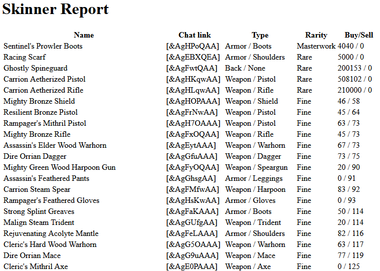

# GW2 Skin Pricer

A collection of Python scripts to help you track down purchasable GW2 skins that you still need to unlock. It also includes purchasable minis.

The four scripts are numbered to remind you of the order they should be executed in:

1. `loaditems.py` downloads tens of thousands of items from the GW2 API and saves a subset of the data to a local database.
2. `loadwardrobe.py` looks for an API key in `config.json` (not included) and downloads a list of all the skins already unlocked for that account.
3. `loadprices.py` generates a list of items with locked skins and then downloads current buy/sell price for sellable items.
4. `query.py` then queries that database and generates an HTML report of the cheapest item you can buy to unlock each skin. You can filter by type  and by maximum buy or sell price. Use the `--help` flag for details

You'll end up with a report that looks somewhat like the following:

